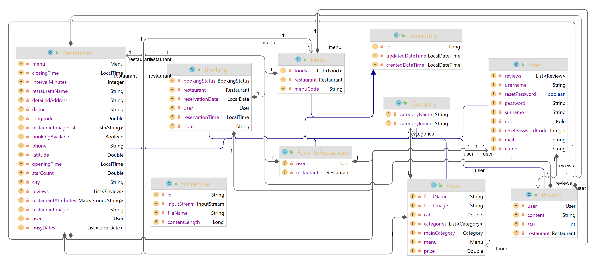
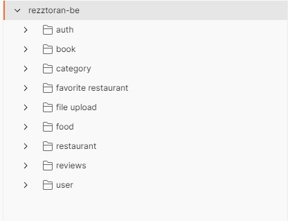
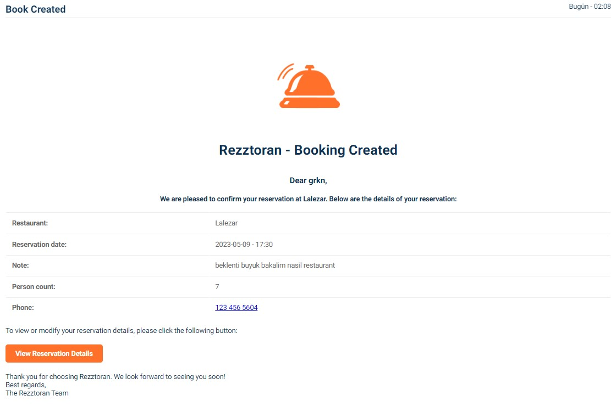
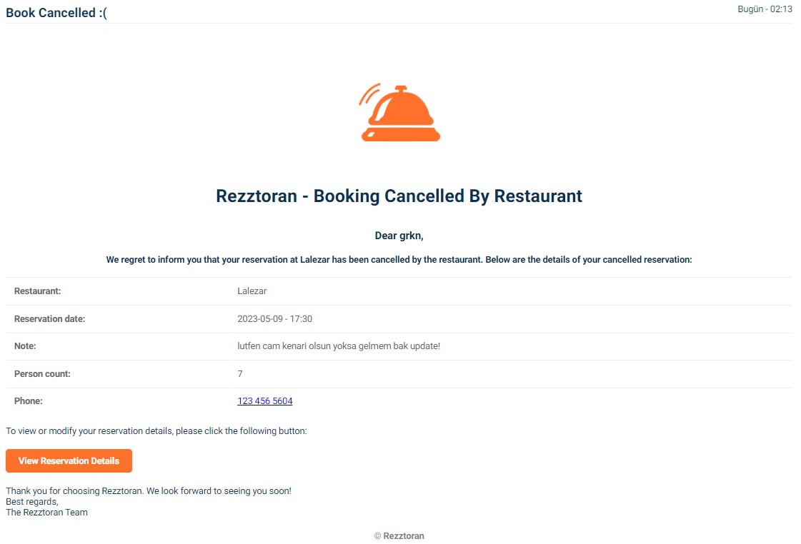
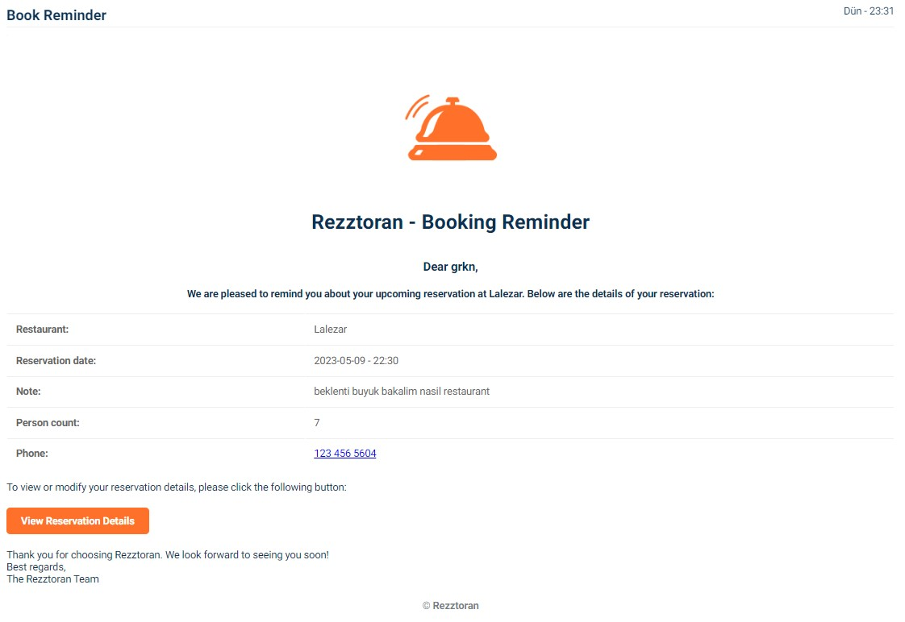

<h1 align="center">
  
</h1>

<h1 align="center">
  Rezztoran - Restaurant Reservation (Booking) System ~ University Graduation Project
</h1>

- frontend: [https://github.com/thekinv21/rezztoran-frontend/tree/thekinv21/WebFinal/web](https://github.com/thekinv21/rezztoran-frontend/tree/thekinv21/WebFinal/web)
- admin panel: [https://github.com/alperenkapusuz/rezztoran-admin-panel](https://github.com/alperenkapusuz/rezztoran-admin-panel)

Rezztoran-be, is a backend restaurant reservation (booking) system that allows restaurants to manage their reservations efficiently. The system enables customers to reserve tables online, while restaurant owners can manage reservations, availability, and guest preferences


## Entity Class Diagram



## Tech Stack


This project is built using a modern tech stack that includes **RESTful**, **Java**, **Spring Boot**, **Docker**, **MySQL**, **Localstack S3**, **Kafka** and **Mail Sender**. Each technology is chosen to fulfill a specific purpose in the project.


## Features

- **Implemented a reservation system.**
- **Authentication using JWT.**
- **Dockerized the project.**
- **Added the review feature.**
- **Added the favorite restaurant feature.**
- **Implemented AWS LocalStack for image uploading.**
- **Implemented custom exception handling and internationalization.**
- **Implemented a password reset mechanism via mail otp code.**
- **Added an email sending mechanism using Kafka.**
- **Added advanced comprehensive pagination, sorting, and filtering.**
- **Implemented a QR code generation system.**
- **Sent a reminder email 3 hours before booking.**
- **Sent an email to the user if a restaurant cancels booking.**
- **Added an authorization checker aspect.**
- **Implemented token invalidation after change password.**


## How to Run

```bash
  docker-compose up -d --build
```

## Example Images


postman_collection


password reset mail


book created mail


book cancelled mail


book reminder mail


