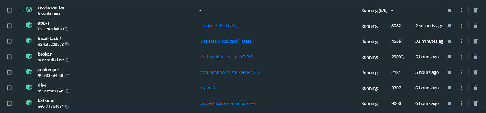
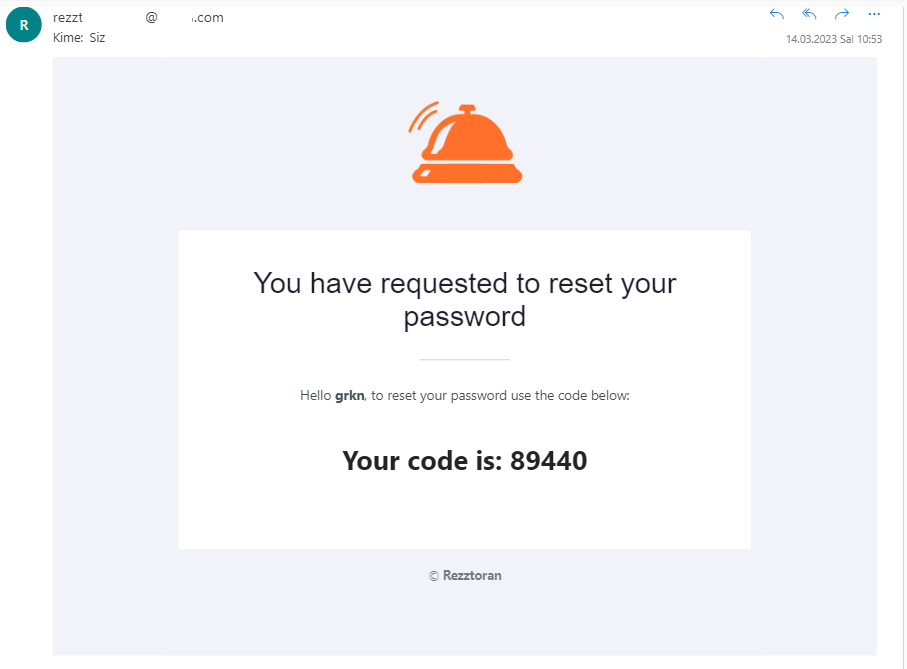
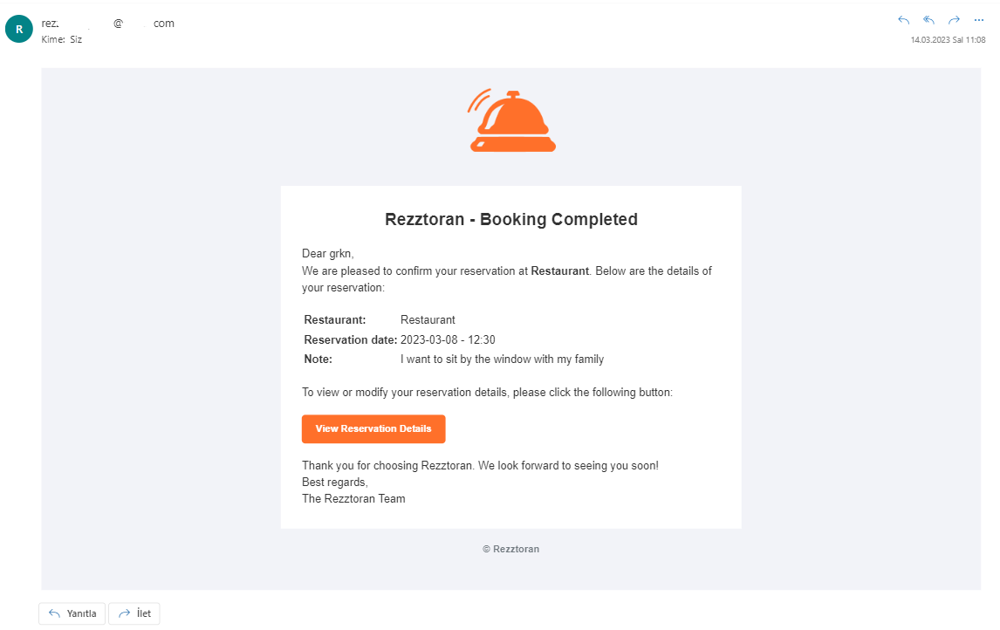

<h1 align="center">
  
</h1>

<h1 align="center">
  Rezztoran - Restaurant Reservation (Booking) System ~backend
</h1>


Rezztoran-be, is a backend restaurant reservation (booking) system that allows restaurants to manage their reservations efficiently. The system enables customers to reserve tables online, while restaurant owners can manage reservations, availability, and guest preferences

## Tech Stack


This project is built using a modern tech stack that includes **RESTful**, **Java**, **Spring Boot**, **Docker**, **MySQL**, **Localstack S3**, **Kafka** and **Mail Sender**. Each technology is chosen to fulfill a specific purpose in the project.





## How to Run

```bash
  docker-compose up -d --build
```

## Example Images


password reset mail


book created mail